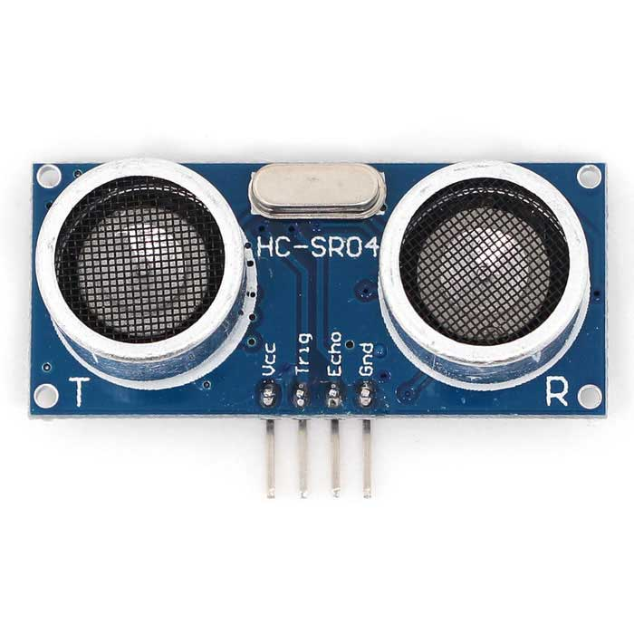

# buggybit
Xmas 2016 play and learn with the kids

# Play and learn
Some aspects
- just play with the buggy
- linefollowing: how to have fun with this (micro:bit sumai wrestling, push out of the circle)
- ultrasonic addition: distance and time
- fun with micro:bit controller: GUI with some leds and and 2 buttons
- and of course, Eddystone Beacon: for some fun additions

## Hardware

### Kitronic buggy with line follower for micro:bit
- https://www.kitronik.co.uk/5604-line-following-buggy-for-the-bbc-microbit.html

#### Motor driver board
https://www.kitronik.co.uk/5620-motor-driver-board-for-the-bbc-microbit-v2.html

- Button A/B avaiable (I/O ?)
- P1/2 I/O available
- P0/8/12/16 used for motor control

#### Line following kit
- https://www.kitronik.co.uk/2125-lf-line-following-add-on-board-for-laser-tank.html
- Uses P1/2 

### Ultrasonic module

- HR-SRO4
- Sonar: As seen from front, Left: T(ransmitter) Right: R(eciever)
- Pins: In order as can be read, top to bottom, Vcc, trig, echo, Gnd

## Software
- https://pxt.microbit.org/ as there is a block/package for the ping trig(pulse) and echo
- https://github.com/Microsoft/pxt-sonar 

## Problems to be solved

### Pins
Which pins for pulse echo and interface resistors for the 3/5v interfacing micro:bit<->Ultransonic module

- P19/20 are the candidates, if they can be made to "normal" i/o.
- it is also possible that further components could be connected with sufficient circuitary to interface i2c1 and from this, inteface to ultrasonic, contact feelers etc

### Bluetooth
micro:bit to micro:bit comunication: pairing and all that jazz

### Finishing!
Some form of closure to each part of the project
- micro:bit controller GUI as a probable need first
- ultrasonic hardware interfacing

## GUI
micro:bit as a GUI to control the buggy and the aspects of user interface
